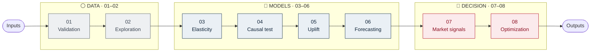

# Retail Pricing & Promotion Optimization

> A spreadsheet of what happened, turned into a defensible answer to one question: **what should this item cost tomorrow?**

ELASTIQ is a retail pricing decision studio. It validates commercial data,
estimates causal price sensitivity, evaluates promotions, forecasts next-period
demand, structures recent market evidence, and recommends a feasible price with
clear controls and provenance. The included dataset is synthetic and intended
for demonstration and validation. The application supports reviewed decisions;
it does not publish prices automatically.

The browser workbench opens directly on its real-time Test Case Runner. It
generates Small (50), Medium (250), Large (1,000), or custom 5-2,000 decision
units, then executes one method, compares all six methods, or creates a context-aware
per-item hybrid across inventory, uncertainty, promotion, and objective regimes.
The default Deep analysis mode runs three search resolutions, size-adjusted
market-shock re-optimizations, 1,000 Monte Carlo draws per method, method
consensus, and independent validation. A Research mode increases this workload;
Standard is the light option. Exact optimizer, candidate-evaluation, uncertainty,
capacity-solver, and validation counters appear live. The pipeline uses real
computations and adds no artificial waiting. Completed runs can be reopened or
downloaded as detailed JSON.

## One-click start

Windows users can double-click `start.bat`.

Linux and macOS users can run:

```sh
chmod +x start.sh
./start.sh
```

The first launch installs web dependencies and then opens
`http://127.0.0.1:5173`. The packaged application already contains demonstration
data. To refresh all analytical outputs before launch, install Python 3.10 or
newer and use `start.bat --refresh-data` or `./start.sh --refresh-data`.

After launch, the **Test Case Runner** opens automatically. Select Small,
Medium, or Large and choose **Run all six approaches**.
Open **Data** to see the initial analysis of completeness, pricing, margin,
demand, inventory pressure, causal coverage, promotion readiness, and category
structure before optimization.

See `RUN_ME_FIRST.txt` for the shortest setup instructions.

## Team documentation

- [High-level team overview](output/pdf/ELASTIQ_Team_Overview.pdf)
- [Detailed technical system guide](output/pdf/ELASTIQ_Technical_System_Guide.pdf)
- [Plain-language application guide](docs/APP_GUIDE.md)
- [Technical reference](docs/TECHNICAL_REFERENCE.md)

## Developer commands

The one-click launchers are sufficient for normal use. Developers can run the
pipeline and validation directly:

```bash
python -m pip install -r requirements.txt
python scripts/run_pipeline.py
make test-python
make test-js
```

The packaged release passes 358 Python tests, all six browser optimization
methods pass their decision controls, the Python and JavaScript demand engines
match on shared fixtures, and the production frontend builds successfully.

Eight stages, three acts. Colour marks distance from a decision — ⚪ slate prepares the evidence, 🔵 blue estimates it, 🔴 red acts on it. **Only step 08 sets a price.**

---

## Pipeline flow



## Pipeline overview

| Stage | 01 | 02 | 03 | 04 | 05 | 06 | 07 | 08 |
|---|:---:|:---:|:---:|:---:|:---:|:---:|:---:|:---:|
| Act | ⚪ | ⚪ | 🔵 | 🔵 | 🔵 | 🔵 | 🔴 | 🔴 |
| Name | Validation | Exploration | Elasticity | Causal test | Uplift | Forecasting | Market signals | Optimization |

*Each stage's product is the next stage's input · Only step 08 sets a price*

---

## ⚪ Act one — what is true? *(01–02)*

The raw feed arrives with duplicates, gaps, and identities that don't reconcile. Nothing downstream is trustworthy until it survives inspection — and until someone has looked and found where the margin actually lives.

### ⚪ 01 · Data validation
`STEP 1 OF 8`

> Nothing downstream is trustworthy until the raw feed is. This stage is the bouncer at the door.

| Input | Activity | Product |
|---|---|---|
| Raw transactions, market notes, schemas, business rules | Checks required fields, missing values, duplicates, ranges, types, and cross-field consistency | Validated datasets, quality summary, validation report |

| Why this stage exists | If this is wrong |
|---|---|
| Every later estimate inherits these rows. Defects here do not raise errors — they propagate quietly. | Duplicate rows double demand and elasticity absorbs it without complaint. |

| Technology | Alternatives | What the business sees |
|---|---|---|
| pandas, NumPy, custom rule checks | Pandera, Great Expectations, dbt tests | A data-quality scorecard: how many rows passed, what was dropped, and why |

`→ product feeds Step 02 · Exploratory analysis`

### ⚪ 02 · Exploratory analysis
`STEP 2 OF 8`

> Before modelling anything, you look. Where is the money, where is the discounting, where is the drift?

| Input | Activity | Product |
|---|---|---|
| Validated retail data | Computes commercial KPIs by product, category, store, region, promotion, and time | KPI tables, portfolio summaries, trend and discount analysis |

| Why this stage exists | If this is wrong |
|---|---|
| Direction before modelling. Knowing where margin lives decides what is worth optimizing at all. | You model the whole catalogue evenly and miss that a handful of items drive the result. |

| Technology | Alternatives | What the business sees |
|---|---|---|
| pandas, Plotly | SQL data marts, Power BI, Tableau | Portfolio dashboards: top and bottom performers, margin leaks, discount depth by category |

`→ product feeds Step 03 · Price elasticity`

---

## 🔵 Act two — what will happen? *(03–06)*

How much demand moves when price moves. Whether that's causal or just an artifact of cutting prices on weak weeks. What promotions genuinely add. And what next period looks like if nothing changes at all.

### 🔵 03 · Price elasticity
`STEP 3 OF 8`

> The core question: if I move price by one percent, how much demand do I lose?

| Input | Activity | Product |
|---|---|---|
| Historical price and demand history | Estimates the demand response to a price change, per item | Elasticity estimates, model statistics, demand-sensitivity classes |

| Why this stage exists | If this is wrong |
|---|---|
| It is the first number a pricing team asks for, and the coefficient step 08 leans on hardest. | Clipping discount outliers attenuates elasticity toward zero and invites false confidence. |

| Technology | Alternatives | What the business sees |
|---|---|---|
| statsmodels, log-log regression | Bayesian regression, hierarchical models, GAMs | Each item tagged elastic, inelastic, or roughly unit elastic, with a confidence on that tag |

`→ product feeds Step 04 · Causal price analysis`

### 🔵 04 · Causal price analysis
`STEP 4 OF 8`

> Correlation lies. Prices get cut because demand was already weak, so a naive elasticity is biased.

| Input | Activity | Product |
|---|---|---|
| Demand, price, controls, instruments such as cost shocks | Tests whether the observed demand change was actually caused by price | OLS vs. IV comparison, causal estimates, first-stage diagnostics |

| Why this stage exists | If this is wrong |
|---|---|
| Price reacts to demand as much as demand reacts to price. An instrument breaks that loop. | A weak instrument passes quietly and every downstream recommendation inherits the bias. |

| Technology | Alternatives | What the business sees |
|---|---|---|
| linearmodels (2SLS), statsmodels | Experiments, difference-in-differences, synthetic control | A credibility check: how far the naive number sits from the causal one |

`→ product feeds Step 05 · Promotion uplift`

### 🔵 05 · Promotion uplift
`STEP 5 OF 8`

> Some promotions create demand. Most discount customers who would have bought anyway.

| Input | Activity | Product |
|---|---|---|
| Promotion flags, demand, price, product, store, historical features | Estimates the incremental demand a promotion actually generates | Uplift predictions, ranked opportunities, segment summaries, saved model |

| Why this stage exists | If this is wrong |
|---|---|
| Promotion spend is only defensible where uplift is incremental rather than coincident. | A promo window misaligned by one day leaks promoted days into control and inflates uplift. |

| Technology | Alternatives | What the business sees |
|---|---|---|
| scikit-learn, XGBoost | Causal forests, X-learner, doubly robust models | A ranked list: which items are worth promoting, which promotions are burning margin |

`→ product feeds Step 06 · Demand forecasting`

### 🔵 06 · Demand forecasting
`STEP 6 OF 8`

> Without a forecast of what happens if you do nothing, there is nothing to price a change against.

| Input | Activity | Product |
|---|---|---|
| Demand history, prices, promotions, calendar, lags, rolling features | Predicts future demand using chronological train, validation, and test splits | Item-level forecasts, evaluation metrics, feature importance, saved model |

| Why this stage exists | If this is wrong |
|---|---|
| Optimization scores every candidate price against a do-nothing baseline. This is that baseline. | Gaps in the calendar let lag and rolling features silently span missing time. |

| Technology | Alternatives | What the business sees |
|---|---|---|
| XGBoost, scikit-learn | LightGBM, CatBoost, ARIMA, Prophet, deep learning | Expected units per item next period, with accuracy stated plainly (MAE, MAPE) |

`→ product feeds Step 07 · Market intelligence`

---

## 🔴 Act three — what should we do? *(07–08)*

The market enters as structured signal rather than prose. Every candidate price is scored against demand, margin, and the rules the business won't break. One price is chosen — and it arrives carrying the constraint that bound it.

### 🔴 07 · Market intelligence
`STEP 7 OF 8`

> Competitor notes and sentiment live as free text. The optimizer can only read columns.

| Input | Activity | Product |
|---|---|---|
| Market notes, competitor observations, customer signals, trends | Converts unstructured text into structured pricing features | Sentiment, competitor, price-sensitivity, promotion-interest, and trend features |

| Why this stage exists | If this is wrong |
|---|---|
| A price is set against a market, not just a demand curve. This is where the market enters. | Recommendations arrive without context and get overridden on instinct by the category manager. |

| Technology | Alternatives | What the business sees |
|---|---|---|
| Retrieval over market notes, feature extraction | Embeddings, vector databases, LLM extraction, topic models | Context beside every recommendation: competitor undercutting, sentiment negative on quality |

`→ product feeds Step 08 · Price optimization`

### 🔴 08 · Price optimization
`STEP 8 OF 8 — FINAL STAGE`

> Everything above converges here. Feasible prices are scored against demand, margin, and constraints.

| Input | Activity | Product |
|---|---|---|
| Price, cost, elasticity, forecasts, uplift, inventory, market features, constraints | Scores feasible price scenarios and selects the most suitable one | Recommended price, expected demand, revenue, profit, action type, constraint status |

| Why this stage exists | If this is wrong |
|---|---|
| This is the only stage that decides. Everything before it is evidence. | A stale cost or a missing constraint yields a recommendation finance or legal will reject. |

| Technology | Alternatives | What the business sees |
|---|---|---|
| SciPy, NumPy grid and constrained search | Nonlinear optimization, Bayesian optimization, reinforcement learning | The decision: raise, hold, or cut. The new price, the expected profit delta, the binding guardrail |

`→ output is the pricing recommendation`

---

## ⚠️ Not an automated pricing system

Nothing here writes a price to a till. Every recommendation is a **proposal**, and requires financial, legal, operational, and governance review before it reaches a shelf.
